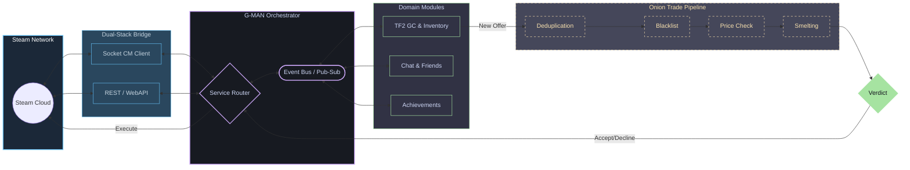

<div align="center">

# 🤖 G-MAN

### The Ultimate Steam & Multi-Game Trading Bot Framework for Go

[](https://pkg.go.dev/github.com/lemon4ksan/g-man)
[](https://goreportcard.com/report/github.com/lemon4ksan/g-man)
[](LICENSE)
[](https://github.com/lemon4ksan/g-man/stargazers)

> _"The right bot in the wrong place can make all the difference in the skins market."_

#### 🇺🇸 [English](README.md) • 🇷🇺 [Русский](README_RU.md)

</div>

**G-man** is a high-performance, enterprise-grade Steam client SDK and multi-game automation framework architected in Go. Built for high-frequency trading, industrial-scale item management, and ultra-resilient network operations, G-man bridges the Steam Network and Game Coordinators into a single, thread-safe orchestrator. It seamlessly integrates **Socket (CM)**, **WebAPI**, and **Game Coordinator** protocols to keep your trade operations live 24/7.

```shell
go get github.com/lemon4ksan/g-man@latest
```

## 🛠 Architecture Overview

The system is designed around a decoupled, event-driven architecture using Go's CSP model. The `Client` serves as the central orchestrator, passing messages across thread-safe modules and automatically balancing workloads:



## ⚡ Key Features

### 🔄 Self-Healing Sessions (Silent Re-auth)

Downtime is lost revenue. G-man monitors the health of Web sessions and access tokens in the background. If a web cookie expires mid-request, the orchestrator automatically pauses active requests, performs an atomic OAuth2 refresh, updates the token storage, and resumes the operation transparently. Your business logic never sees a `401 Unauthorized` or standard session drop.

### 🌐 Dual-Stack Transport Engine

Stop choosing between WebAPI and Connection Manager (CM) Sockets. G-man's protocol-agnostic routing layer dynamically selects the optimal path: **TCP/WebSocket CM channels** for low-latency state synchronization, or **HTTPS WebAPI** for high-volume transactions and rate-limit mitigation. It seamlessly falls back to HTTP if a socket connection is interrupted.

### 🧅 "Onion" Trade Middleware Pipeline

Build complex trading logic as decoupled middleware layers. Process incoming trade offers through an extensible chain: `Deduplicator` $\rightarrow$ `SecurityEscrowCheck` $\rightarrow$ `BlacklistFilter` $\rightarrow$ `PriceDBValidator` $\rightarrow$ `AutoSmelter`. If any middleware sets a verdict (Accept/Decline/Counter), execution halts safely, preventing race conditions.

### 🌡️ Defensive Web Scraping

Steam often throws "Soft Errors" – HTML pages returning a `200 OK` status code but displaying warning messages (e.g., "Rate Limit Exceeded", "Family View Active", or login prompts). G-man's `community` scraper scans raw response bodies, converts ambiguous HTML blocks into strictly-typed Go errors, and triggers safety handlers.

### 🎒 Team Fortress 2 (TF2) Economy Suite

G-man comes out of the box with a fully-integrated, production-grade TF2 trading package:

- **Stateful PriceDB & Autopricer:** Real-time Socket.IO pricing updates and local cache synchronization.
- **Competitor Undercutting & Swing Protection:** Scrapes backpack.tf's active snapshots, automatically outpricing competitors while applying strict swing limits to protect against price manipulation.
- **Smart Counter-Offers & Metal Smelting:** Automatically calculates value differentials, smelts or combines metals (`Refined` $\leftrightarrow$ `Reclaimed` $\leftrightarrow$ `Scrap`) to make precise change, and pulls missing keys or items from the partner's inventory to construct a smart counter-offer.
- **Achievement Simulator:** Emulates human-like achievement unlocks and stat reports using legit-mimicking behavior to avoid bot flags.

## 📂 Project Directory Structure

```text
pkg/
├── steam/            # Core Steam Protocols & Lifecycle Management
│   ├── auth/         # OAuth2 flows, persistent storage, and background token refresh
│   ├── socket/       # Stateful CM (Connection Manager) TCP/WebSocket client
│   ├── protocol/     # Steam wire-format, compiled protobufs & language specs
│   ├── transport/    # Dual-stack transport bridge (Socket/HTTP router)
│   ├── social/       # Real-time chat, persona states, and friends tracking
│   ├── community/    # Defensive scrapers (Inventories, Market, Steam Guard)
│   └── sys/          # Core subsystems (Game Coordinator dispatcher, directory)
├── tf2/              # Production TF2 Trading & Item Domain Modules
│   ├── schema/       # Dynamic schema Normalizer, defindex lookups, SKU generator
│   ├── currency/     # Metal arithmetic (Keys, Refined, Reclaimed, Scrap)
│   ├── backpack/     # Unified SOCache-Web inventory synchronizer
│   ├── pricedb/      # Pluggable pricing adapters with Socket.IO updates
│   ├── bptf/         # Stateful backpack.tf listing and snapshot manager
│   └── behavior/     # High-level actions (auto-smelting, stock limits, balance)
├── behavior/         # Generic Bot Behaviors & Human Mimicry
│   └── achievements/ # Achievement simulator imitating legitimate gameplay
├── trading/          # Unified Trade Offers Engine
│   └── engine/       # Onion middleware engine with TradeContext propagation
├── bus/              # Decoupled thread-safe event bus
└── rest/             # Type-sanitizing HTTP & REST API client
```

## 🚀 Quick Start

### 1. Initialize the Client

Connect to the Steam network, authenticate, and register the automated trade processor in just a few lines:

```go
package main

import (
	"context"
	"os"

	"github.com/lemon4ksan/g-man/pkg/log"
	"github.com/lemon4ksan/g-man/pkg/steam"
	"github.com/lemon4ksan/g-man/pkg/steam/auth"
	"github.com/lemon4ksan/g-man/pkg/steam/sys/directory"
	"github.com/lemon4ksan/g-man/pkg/storage/jsonfile"
	"github.com/lemon4ksan/g-man/pkg/tf2"
	"github.com/lemon4ksan/g-man/pkg/trading/engine"
	webtrading "github.com/lemon4ksan/g-man/pkg/trading/web"
)

func main() {
	// 1. Set up a persistent JSON file storage for session tokens
	store, _ := jsonfile.New("storage.json")
	logger := log.New(log.DefaultConfig(log.LevelInfo))

	// 2. Instantiate the orchestrator with TF2 and Trading modules
	client, _ := steam.NewClient(steam.Config{Storage: store},
		steam.WithLogger(logger),
		tf2.WithModule(), 
		webtrading.WithModule(webtrading.Config{}),
	)
	defer client.Close()

	// 3. Connect the Engine to the Trade Manager via Automated Processor
	tradeEngine := engine.New()
	// Add your middlewares here...
	
	webTradeManager := client.Module("trading").(*webtrading.Manager)
	webTradeManager.SetOfferHandler(context.Background(), engine.NewBotHandler(tradeEngine, logger), nil)

	// 4. Fetch optimal server and login
	dir := directory.New(client.Service())
	server, _ := dir.GetOptimalCMServer(context.Background())
	login := auth.NewLogOnDetails(os.Getenv("STEAM_USER"), os.Getenv("STEAM_PASS"))

	if err := client.Run(); err != nil {
		panic(err)
	}

	if err := client.ConnectAndLogin(context.Background(), server, login); err != nil {
		panic(err)
	}

	client.Wait()
}
```

### 2. Configure custom Onion Trading Middlewares

You can implement complex trade routing policies by building clean, decoupled middleware. Here is a custom middleware that validates the price of TF2 items using `pricedb`:

```go
package main

import (
	"github.com/lemon4ksan/g-man/pkg/trading"
	"github.com/lemon4ksan/g-man/pkg/trading/engine"
	"github.com/lemon4ksan/g-man/pkg/trading/reason"
)

// PriceValidationMiddleware enforces strict price matches
func PriceValidationMiddleware(priceProvider PriceProvider) engine.Middleware {
	return func(next engine.Handler) engine.Handler {
		return func(ctx *engine.TradeContext) error {
			for _, item := range ctx.Offer.ItemsToGive {
				price, err := priceProvider.GetPrice(item.SKU)
				if err != nil {
					ctx.Review(reason.ReviewEngineError)
					return err
				}

				if item.Value < price.SellMinVal {
					// Partner offered too little: Decline trade instantly
					ctx.Decline(reason.DeclineUnderpaid)
					return nil // Halt chain
				}
			}

			return next(ctx)
		}
	}
}
```

## 🚀 Memory & Performance Efficiency

G-MAN is architected for maximum resource efficiency, achieving an exceptionally small runtime footprint:
- **Core Bot Architecture:** Requires only **~4.5 MB** of live heap memory (including the event bus, social modules, and trade managers).
- **TF2 Schema Engine:** Holds a fully active, O(1)-indexed schema in a tiny **~10 MB** heap space, resulting in only **~25 MB RSS** overall physical memory usage in production.
- **Built-in Profiling:** Run our offline memory walkthrough and generate a `pprof` heap profile to inspect allocations directly:

```shell
go test -v ./examples/tf2_bot -run TestFullBotMemoryProfile
```

## 🏗 Roadmap

### Core Infrastructure

- [x] **Smart Transport Routing:** Thread-safe dynamic requests via Sockets or HTTP.
- [x] **WebSession Keep-Alive:** Auto-refresh loops for web-cookies and API keys.
- [x] **Silent Re-Authentication:** Background recovery of expired JWTs.
- [x] **Global Proxy Tunneling:** Clean SOCKS5/HTTP integration for all modules.
- [ ] **Steam CDN Downloader:** Dynamic downloading and parsing of app manifests/game assets.

### TF2 Domain & Game Coordinator

- [x] **Unified Inventory Cache:** Real-time synchronization between SOCache and Web inventory.
- [x] **Dynamic SKU Normalizer:** Parser for quality, index, effect, and item definition attributes.
- [x] **Automatic Smelter:** Multi-stage weapon combining and metal smelting.
- [x] **Backpack.tf Synchronization:** Listing management and snapshot parsing.
- [ ] **CS2 Coordinator:** GC-handshakes, item skin parsing, and match history tracking.
- [ ] **Dota 2 Coordinator:** SOCache item parsing and custom lobby manager.

## 🤝 Contributing

We welcome contributions to G-man! If you want to add support for new storage adapters, expand CS2/Dota 2 GC structures, or improve defensive scraping algorithms:

1. Review our design philosophy in [CONTRIBUTING.md](CONTRIBUTING.md).
2. Ensure new network dependencies are minimal and run through the `transport.Doer` interface.
3. Write matching unit tests and verify concurrency safety using `go test -race ./...`.

## ☕ Support the Development

Building a industrial-scale Steam SDK takes hundreds of hours of protocol reverse-engineering. If G-man helped you automate your trading workflows or optimized your server resources, feel free to show some support:

<div align="center">

[](https://steamcommunity.com/tradeoffer/new/?partner=1141078357&token=HjsTJQFX)

> _"Donations... are not a requirement, but... they fulfill the terms of our... agreement."_

</div>

## ⚖️ Legal & License

**Disclaimer:** This software is **not** affiliated with, maintained by, or endorsed by **Valve Corporation** or any of its subsidiaries. Steam, Team Fortress 2, and all related Valve properties are registered trademarks of Valve Corporation. Use of this library is at your own risk.

This project is licensed under the **BSD 3-Clause License**. See [LICENSE](LICENSE) for full details.

---

<div align="center">
  <sub>Prepare for unforeseen consequences... or just prepare for the next Steam Sale.</sub>
</div>
