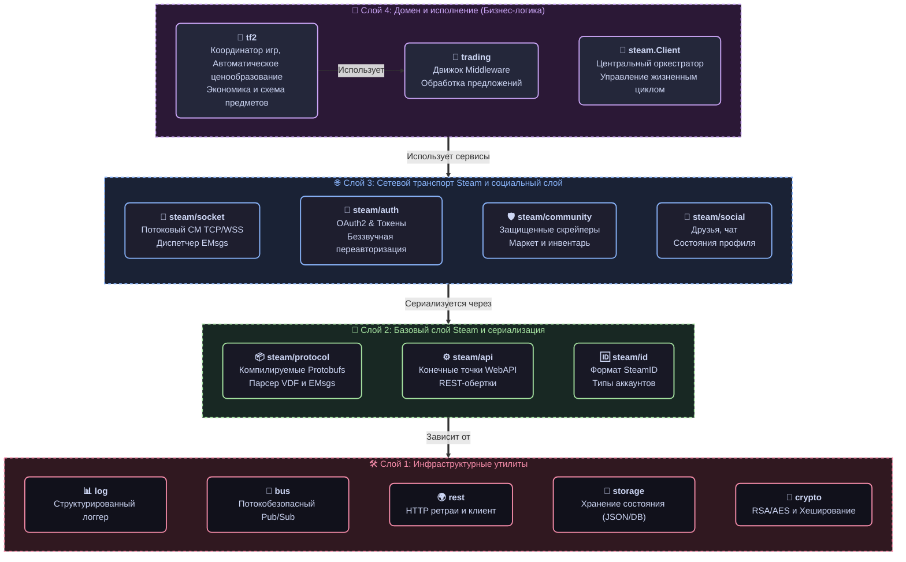

# 📦 G-MAN SDK Пакеты

### Модульные, интерфейсно-ориентированные компоненты для автоматизации Steam и игровых координаторов

#### 🇺🇸 [English](README.md) • 🇷🇺 [Русский](README_RU.md)

Этот каталог содержит общедоступный API фреймворка **G-man**. Представленные пакеты образуют слабосвязанную модульную экосистему. Вы можете импортировать всю библиотеку для создания полнофункционального Steam-бота или точечно выбирать отдельные пакеты (например, `tf2/sku` для парсинга цен предметов, `steam/community` для скрейпинга инвентарей или `crypto` для генерации мобильных кодов 2FA) для интеграции в ваши существующие Go-приложения.

## 🏗 Иерархия зависимостей пакетов

Чтобы поддерживать максимальную производительность и избегать циклического импорта (частая ловушка в Go), G-man строго следует **многоуровневой иерархии импортов**. Нижние слои никогда не должны импортировать пакеты из верхних:

## 📦 Обзор пакетов

### 1. ⚙️ Базовый слой (`pkg/steam`)
Фундамент фреймворка. Он берет на себя низкоуровневую рутину: сетевое взаимодействие, сериализацию протоколов и оркестрацию API.

| Пакет | Описание |
| :--- | :--- |
| 🔌 **[steam](steam/)** | Главный **Оркестратор**. Связывает сокеты, авторизацию и доменные модули в единый потокобезопасный `Client`. |
| 🌐 **[steam/api](steam/api/)** | Описание конечных точек, типы ошибок Steam (`EResult`) и универсальные распаковщики ответов (VDF, JSON, Proto). |
| 🔑 **[steam/auth](steam/auth/)** | Современные сценарии авторизации OAuth2. Поддержка JWT, Refresh-токенов и фонового обновления сессии. |
| 🕵️‍♂️ **[steam/community](steam/community/)** | Защищенный веб-клиент для скрейпинга инвентарей `steamcommunity.com`, торговой площадки и авторизации OpenID. |
| 🛡️ **[steam/guard](steam/guard/)** | Подтверждение операций в мобильном аутентификаторе Steam Guard, генерация кодов 2FA и управление сессией. |
| 🆔 **[steam/id](steam/id/)** | Парсер и форматирование идентификаторов `SteamID` (поддержка форматов SID2, SID3 и 64-битных значений). |
| 🔄 **[steam/socket](steam/socket/)** | Стейтфул-клиент для Connection Manager (CM) сокетов. Управление пингами, маршрутизацией и асинхронными задачами. |
| 📡 **[steam/service](steam/service/)** | Коммандер RPC, транслирующий protobuf-сообщения в унифицированные сервисные вызовы Steam. |
| 💬 **[steam/social](steam/social/)** | Социальные функции: статусы пользователей в реальном времени, списки друзей и чат. |
| 🌉 **[steam/transport](steam/transport/)** | Двухстековый транспортный мост, объединяющий CM-сокет и HTTP-клиент в единую абстракцию. |
| 🛠 **[steam/webapi](steam/webapi/)** | Автоматически сгенерированные обертки для официальных Web API компании Valve. |

### 2. 🔌 Системные модули и Координаторы (`pkg/steam/sys`)
Шлюзы к внутренним системным службам Steam и игровым серверам.

| Пакет | Описание |
| :--- | :--- |
| 🕹 **[sys/gc](steam/sys/gc/)** | Базовый клиент игрового координатора. Рукопожатие GC-Hello и мультиплексированная маршрутизация пакетов. |
| 🗺 **[sys/directory](steam/sys/directory/)** | Менеджер API `ISteamDirectory` для динамического обновления актуального пула IP-адресов CM-серверов. |
| 📦 **[sys/apps](steam/sys/apps/)** | Управление статусом нахождения бота "В игре" и перехват системных сокет-уведомлений. |

### 3. 🧠 Торговая логика (`pkg/trading`)
Высокоуровневый движок для построения автоматизированных торговых систем.

| Пакет | Описание |
| :--- | :--- |
| 🧅 **[trading/engine](trading/engine/)** | **Движок торговых middleware (Onion)**. Цепочки последовательных проверок сделок с контекстом. |
| ⚙️ **[trading/processor](trading/processor/)** | Менеджер жизненного цикла транзакций (*Проверить $\rightarrow$ Решить $\rightarrow$ Действовать $\rightarrow$ Оповестить*). |
| 📋 **[trading/review](trading/review/)** | Логирование сделок высокой стоимости, аудит и отправка на ручную модерацию. |
| 🤝 **[trading/live](trading/live/)** | Поддержка игровых сессий обмена в реальном времени ("Live Trade") через GC. |
| 🌐 **[trading/web](trading/web/)** | Стандартные операции с торговыми предложениями (Trade Offers) через веб-интерфейс Community API. |

### ⚔️ 4. Домен Team Fortress 2 (`pkg/tf2`)
Специализированные пакеты для парсинга схем предметов TF2, ведения цен и координации инвентарей.

| Пакет | Описание |
| :--- | :--- |
| 🏷 **[tf2/sku](tf2/sku/)** | Строковый парсер и генератор SKU-идентификаторов для точного определения свойств предметов TF2. |
| 📈 **[tf2/bptf](tf2/bptf/)** | Интеграция с сервисом backpack.tf (активные листинги, парсинг снапшотов цен и отправка сигналов). |
| 🪙 **[tf2/currency](tf2/currency/)** | Валютная арифметика металлов. Потокобезопасные вычисления с Refined, Reclaimed, Scrap и Key. |
| 🎒 **[tf2/inventory](tf2/inventory/)** | Единый координатор инвентаря, синхронизирующий Web-инвентарь и SOCache игрового координатора. |
| 💲 **[tf2/pricedb](tf2/pricedb/)** | Подключаемый локальный менеджер цен с поддержкой реалтайм-обновлений через Socket.IO. |
| 📖 **[tf2/schema](tf2/schema/)** | Динамический индексатор схемы предметов TF2 для сверхбыстрого поиска defindex и атрибутов за O(1). |
| 🔨 **[tf2/crafting](tf2/crafting/)** | Сценарии автоматического крафта: объединение оружия, плавка металлов и объединение в очищенные. |

### 🛠 5. Инфраструктура и Хранилище
Общие утилиты и провайдеры постоянного хранения, используемые во всем SDK.

| Пакет | Описание |
| :--- | :--- |
| 🎭 **[behavior](behavior/)** | Сценарии автоматического поведения ботов (человекоподобные ачивки, симуляция статистики). |
| 🚌 **[bus](bus/)** | Высокопроизводительная потокобезопасная **Шина событий** для слабой связи модулей. |
| 🔐 **[crypto](crypto/)** | Специфические криптографические алгоритмы (ECC, RSA) и генерация TOTP 2FA. |
| ⏳ **[jobs](jobs/)** | Асинхронный потокобезопасный трекер задач для связки сокет-запросов с их ответами. |
| 📝 **[log](log/)** | Контекстный логгер с разделением по модулям и структурированным выводом. |
| 🚀 **[rest](rest/)** | Обертка HTTP-клиента с автоповторами запросов, экспоненциальной задержкой и сериализацией. |
| 💾 **[storage](storage/)** | Модульная абстракция постоянного хранения сессий (поддержка SQLite, JSON и памяти). |

## 🏗 Архитектурные принципы

При разработке пакетов G-man строго учитываются **лучшие практики разработки на Go**:

1. **Независимость от протокола**: Приложения отправляют запросы через `steam.Client.Do()`. Внутренний роутер автоматически перенаправляет вызов либо в CM-сокет (для реалтайм-скорости), либо в HTTP WebAPI (при разрыве соединения).
2. **Проектирование от интерфейсов**: Компоненты взаимодействуют между собой исключительно через узкоспециализированные интерфейсы (`Requester`, `Doer`). Это делает всю систему легко мокаемой для тестов.
3. **Безопасная конкурентность**: Фоновые циклы, пинги и сокет-соединения используют `sync/atomic` и RWMutex. Все блокирующие сетевые вызовы обязательно принимают `context.Context`.
4. **Защитный скрейпинг**: Веб-клиент `community` превентивно переводит скрытые HTML-ошибки Steam (например, лимиты запросов, возвращающие страницу заглушку с 200 OK) в строго типизированные ошибки Go вроде `ErrRateLimited`.
