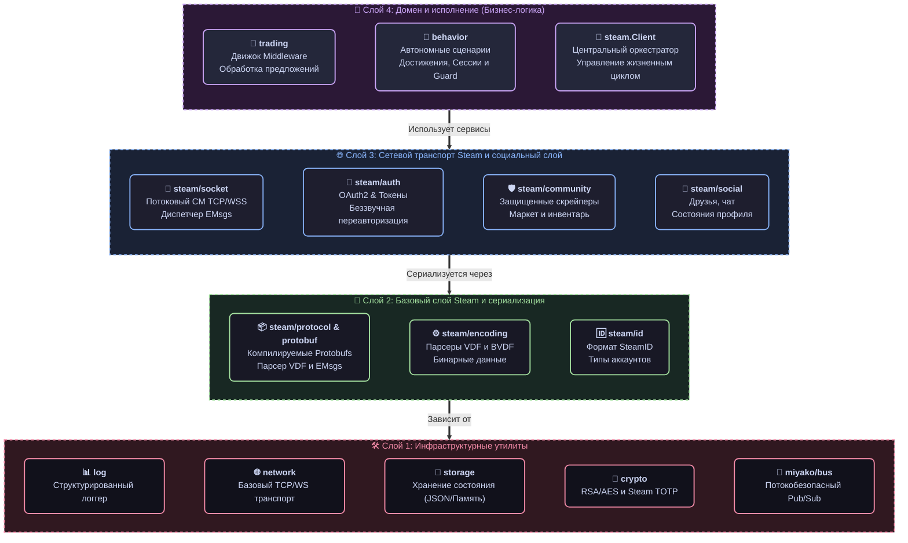

# 📦 G-MAN SDK Пакеты

### Модульные, интерфейсно-ориентированные компоненты для автоматизации Steam и игровых координаторов

#### 🇺🇸 [English](README.md) • 🇷🇺 [Русский](README_RU.md)

Этот каталог содержит общедоступные пакеты G-man. Вы можете импортировать фреймворк целиком или точечно выбирать отдельные пакеты (например, `steam/community` для скрейпинга, `trading/engine` для создания конвейеров проверок или `crypto` для генерации кодов TOTP) для интеграции в существующие проекты.

## 🏗 Иерархия зависимостей пакетов

Чтобы поддерживать оптимальную структуру и избегать циклического импорта, G-man строго следует **многоуровневой иерархии импортов**. Нижние слои никогда не должны импортировать пакеты из верхних:

## 📦 Обзор пакетов

### 1. Базовый слой и Protobuf (`pkg/steam` & `pkg/protobuf`)
Фундамент фреймворка, реализующий сетевое взаимодействие, сериализацию протоколов и оркестрацию API.

| Пакет | Описание |
| :--- | :--- |
| **[steam](steam/)** | Главный Orchestrator. Связывает сокеты, авторизацию и доменные модули в единый потокобезопасный клиент. |
| **[steam/auth](steam/auth/)** | Сценарии авторизации OAuth2, отслеживание JWT и фоновое обновление сессии. |
| **[steam/community](steam/community/)** | Защищенный веб-клиент для работы с инвентарями `steamcommunity.com`, торговой площадкой и авторизацией OpenID. |
| **[steam/encoding](steam/encoding/)** | Сериализация KeyValues (VDF), кодирование и декодирование Binary VDF (BVDF). |
| **[steam/guard](steam/guard/)** | Подтверждение операций в мобильном аутентификаторе Steam Guard, генерация кодов 2FA и управление сессией. |
| **[steam/id](steam/id/)** | Парсер и форматирование идентификаторов `SteamID` (поддержка SID2, SID3 и 64-битных значений). |
| **[steam/socket](steam/socket/)** | Стейтфул-клиент для CM-сокетов, управляющий пингами, маршрутизацией и асинхронными задачами. |
| **[steam/service](steam/service/)** | Коммандер RPC, транслирующий Protobuf-сообщения в унифицированные сервисные вызовы. |
| **[steam/social](steam/social/)** | Социальные функции: статусы пользователей в реальном времени, списки друзей и чат. |
| **[steam/transport](steam/transport/)** | Двухстековый транспортный мост, объединяющий CM-сокеты и HTTP в единую абстракцию. |
| **[steam/webapi](steam/webapi/)** | Автоматически сгенерированные обертки для официальных Web API Steam. |
| **[protobuf](protobuf/)** | Сгенерированные спецификации Protobuf Steam (`steam`) и пользовательские структуры (`custom`). |

### 2. Системные и игровые координаторы (`pkg/steam/sys`)
Шлюзы к внутренним механизмам Steam и серверам конкретных игр.

| Пакет | Описание |
| :--- | :--- |
| **[sys/account](steam/sys/account/)** | Управление статусом безопасности аккаунта и системными параметрами. |
| **[sys/apps](steam/sys/apps/)** | Управление статусом нахождения в игре и обработка сокет-уведомлений приложений. |
| **[sys/directory](steam/sys/directory/)** | Клиент API ISteamDirectory для динамического получения списков активных IP-адресов CM-серверов. |
| **[sys/gc](steam/sys/gc/)** | Базовый клиент игрового координатора (Game Coordinator). Управление рукопожатиями и мультиплексированием пакетов. |
| **[sys/notifications](steam/sys/notifications/)** | Подсистема получения и обработки платформенных пуш-уведомлений Steam. |

### 3. Торговая логика (`pkg/trading`)
Высокоуровневый движок обработки запросов торговых предложений.

| Пакет | Описание |
| :--- | :--- |
| **[trading/engine](trading/engine/)** | Движок **Onion Middleware**. Строит конвейер проверок сделки с передачей контекста. |
| **[trading/processor](trading/processor/)** | Менеджер жизненного цикла транзакции (*Проверка $\rightarrow$ Решение $\rightarrow$ Действие $\rightarrow$ Уведомление*). |
| **[trading/reason](trading/reason/)** | Причины аудита сделок, структурированные коды ошибок и типы вердиктов. |
| **[trading/notifications](trading/notifications/)** | Асинхронные события торговли и вещание обновлений статуса обменов. |
| **[trading/review](trading/review/)** | Аудит ценных транзакций, логирование сделок и административный разбор. |
| **[trading/live](trading/live/)** | Поддержка игровых сессий обмена в реальном времени ("Live Trade") через GC. |
| **[trading/web](trading/web/)** | Веб-операции обмена предложениями через API сообщества и их обработка. |

### 4. Инфраструктура и служебные пакеты
Вспомогательные утилиты, используемые в рамках всего SDK.

| Пакет | Описание |
| :--- | :--- |
| **[behavior](behavior/)** | Сценарии автоматического поведения ботов (эмуляция достижений, проверка сессий, авто-принятие подтверждений Guard). |
| **[command](command/)** | Регистрация CLI-команд, валидация типов на основе рефлексии и их выполнение. |
| **[crypto](crypto/)** | Алгоритмы RSA/AES, генерация TOTP и подписи для мобильной авторизации Steam. |
| **[log](log/)** | Контекстный асинхронный структурированный логгер с поддержкой Correlation ID. |
| **[network](network/)** | Базовый сетевой слой TCP и WebSocket сокетов, фреймеры сообщений и унифицированные ошибки. |
| **[storage](storage/)** | Провайдер постоянного хранения данных с адаптерами JSON (`jsonfile`) и памяти (`memory`). |

## 📐 Архитектура и принципы проектирования

Пакеты G-man спроектированы в соответствии с ключевыми практиками языка Go:

1. **Изолированное тестирование (Mockability):** Структуры зависят от лаконичных интерфейсов (таких как `transport.Doer` или `storage.Provider`), а не от конкретных реализаций, что упрощает написание модульных тестов.
2. **Конкурентность на базе каналов:** Передача событий внутри системы осуществляется через шину событий `miyako/bus` во избежание взаимных блокировок. Совместно используемое состояние защищено при помощи `sync/atomic` и RWMutex.
3. **Декаплинг расширений:** Чтобы избежать раздувания кодовой базы, специализированная логика игровых экономик вынесена во внешние пакеты (например, `g-man-tf2`). Это позволяет ядру оставаться легким и производительным.
